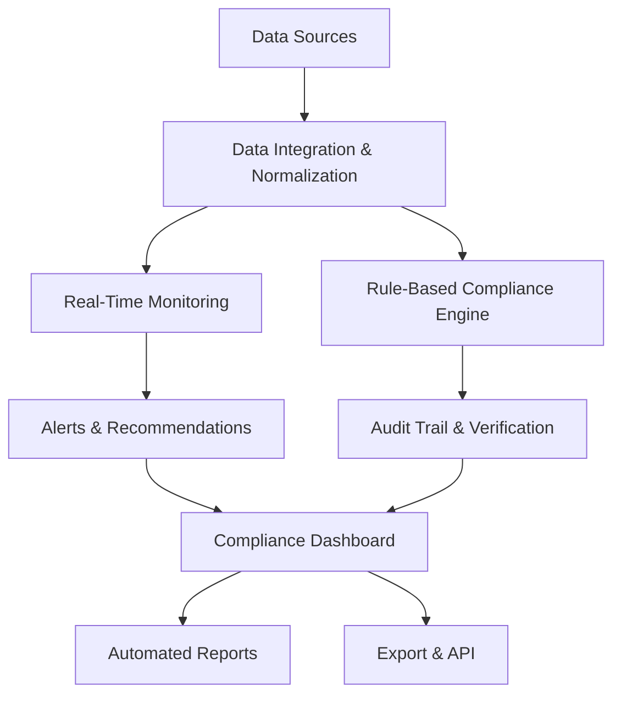

# RANTAI Sentinel

RANTAI Sentinel adalah automate ESG compliance monitoring & reporting platform dengan kombinasi data on-chain (transaksi, carbon), off-chain (ERP, sensor IoT), dan regulatory frameworks (GRI, SDGs, GHG Protocol) — hasilnya: realtime dashboard, audit trail immutable, alert & automated reporting.

---

## Core Features

- 🔗 Data Integration & Normalization – konsolidasi data on-chain (transaksi, carbon footprint, offset credits) dan off-chain (energi, limbah, ERP/CRM, IoT).

- ⏱️ Real-Time Monitoring – pantau KPI ESG dan status compliance secara terus-menerus.

- ⚖️ Rule-Based Compliance Engine – evaluasi otomatis berdasarkan GRI, SASB, SDGs, atau regulasi lokal.

- 📝 Audit Trail & Verification – semua aktivitas compliance dicatat secara immutable.

- 🔔 Alerts & Recommendations – notifikasi dini, pengingat deadline, serta rekomendasi mitigasi.

- 📊 Automated Reporting – laporan kepatuhan siap pakai dalam format standar internasional.

- 🌐 Export & API – laporan ESG dapat diekspor ke berbagai format atau diintegrasikan ke sistem eksternal.

---

## Flow Diagram

---

## Kontribusi

Kontribusi sangat kami sambut! Silakan ikuti langkah berikut:

- Fork repository

- Buat branch fitur baru: git checkout -b feature/nama-fitur

- Commit perubahan Anda: git commit -m 'Tambah fitur baru'

- Push ke branch Anda: git push origin feature/nama-fitur

- Buat pull request di repository ini

- Harap pastikan kode teruji dan mengikuti style yang sudah ada.

---

## Lisensi

Proyek ini dilisensikan di bawah MIT License - baca file LICENSE untuk informasi lebih lanjut.
